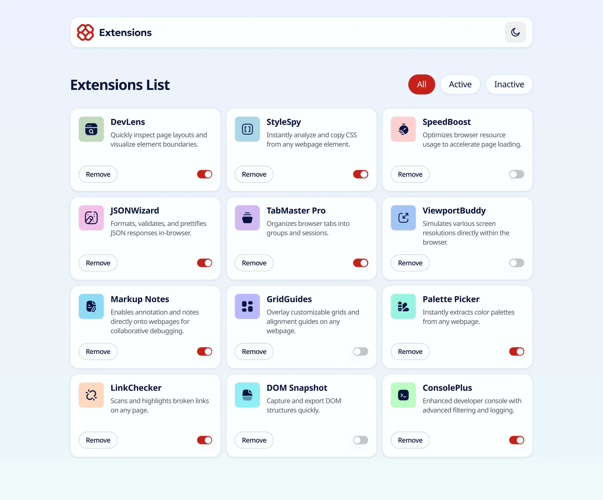
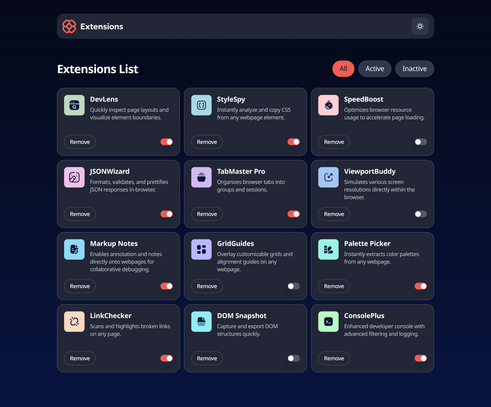

# Frontend Mentor - Browser extensions manager UI solution

This is a solution to the
[Browser extensions manager UI challenge on Frontend Mentor](https://www.frontendmentor.io/challenges/browser-extension-manager-ui-yNZnOfsMAp).
Frontend Mentor challenges help me improve my coding skills by building realistic projects.

## Table of contents

- [Overview](#overview)
  - [The challenge](#the-challenge)
  - [Screenshot](#screenshot)
  - [Links](#links)
- [My process](#my-process)
  - [Built with](#built-with)
  - [What I learned](#what-i-learned)
  - [Continued development](#continued-development)
  - [Useful resources](#useful-resources)
- [Author](#author)

## Overview

### The challenge

Users should be able to:

- Toggle extensions between active and inactive states
- Filter active and inactive extensions
- Remove extensions from the list
- Select their color theme
- View the optimal layout for the interface depending on their device's screen size
- See hover and focus states for all interactive elements on the page

### Screenshots

**Light mode:**



**Dark mode:**



### Links

- Solution URL: [Add solution URL here](https://your-solution-url.com)
- Live Site URL: [Live site URL](https://browser-extension-manager-ui-one.vercel.app/)

## My process

### Built with

- Semantic HTML5
- Tailwind CSS
- Flexbox and CSS Grid
- Mobile-first responsive design
- [React](https://reactjs.dev)
- [Framer Motion](https://motion.dev) (for smooth animations)
- [Zustand](https://zustand.docs.pmnd.rs) (for state management)
- [Radix UI](https://www.radix-ui.com/) (for accessible primitives)

### What I learned

- Managing global state for UI filtering and toggling using Zustand store.
- Improving removal and filtering UX with smooth staggered animations.
- Handling responsive grid layouts with Tailwind and custom properties.

Example how to use Framer Motion with Typescript

```jsx
import { type Variants } from 'motion/react';
const containerVariants: Variants = {
  closed: {},
  open: {
    transition: {
      staggerChildren: 0.08,
    },
  },
};

const buttonVariants: Variants = {
  closed: {
    opacity: 0,
    y: 10,
  },
  open: {
    opacity: 1,
    y: 0,
    transition: { type: 'spring', stiffness: 500, damping: 30 },
  },
};
```

### Continued development

- Implement drag-and-drop to reorder extensions.

### Useful resources

- [Framer Motion Documentation](https://motion.dev) - Helped me animate components easily and
  responsively.
- [Zustand Docs](https://zustand.docs.pmnd.rs) - Helped manage UI state with a simple API.

## Author

- Website - [Add your name here](https://www.your-site.com)
- Frontend Mentor - [@Sergio0831](https://www.frontendmentor.io/profile/Sergio0831)
- GitHub - [Sergio0831](https://github.com/Sergio0831)
